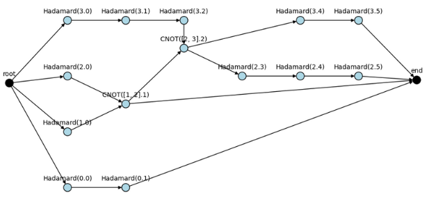

# Quantum-compiler
A quantum compiler implementation of PCOAST (Pauli-based Quantum Circuit Optimization Framework) in Python.
Not everthing is implemented yet. The following is a list of what is implemented and what is not.

## Installation
First start by creating an environment and 

### Usage
Create a file that will be the definition of your circuit. For example:

circuit.cir
```
2,2 # First line define the quantum wire and classical wire separate by a comma in this order
# You can then add any gates you will, it MUST be a pennylane gate
Hadamard(0) # Specify the gates followed by the wire inside parentheses
CNOT(0,1) # For multi wire gates you can define them as such

# You can jump lines and mark comments using the '#' character
Hadamard(0)
Hadamard(1)
```
To use the compilation on your file
```bash
python src/main.py relative/path/to/file.cir
```
It will generate first a graph from the inputted circuit using the analyser. Here's an example: 



### Limitation
- [Debugging graph] when showing a debugging graph for a specific circuit, some nodes may not show in the correct order.
- [Optimization] the optimization algorithm is not implemented yet.

## Reference
[PCOAST](https://arxiv.org/pdf/2305.10966v2.pdf)
